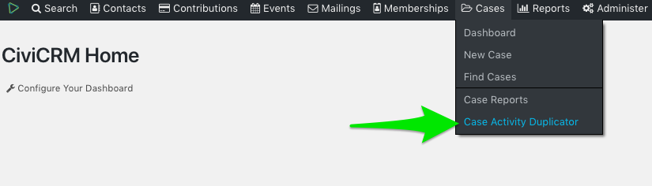
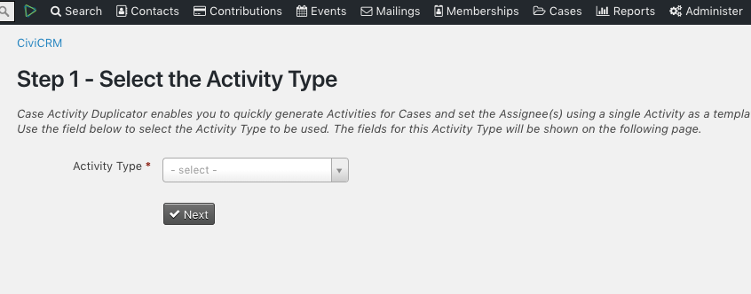
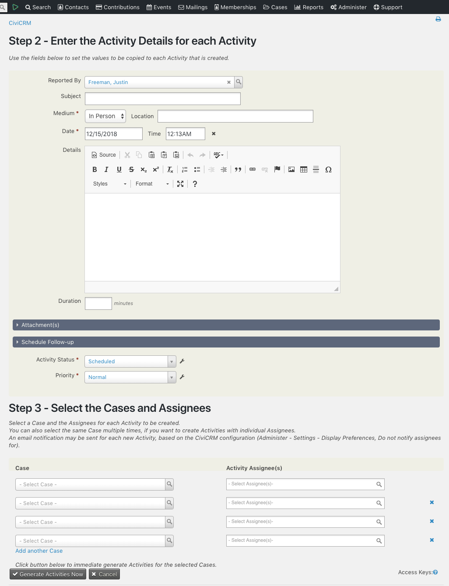

# Case Activity Duplicator (au.com.agileware.caseactivityduplicator)

This is a [CiviCRM](https://civicrm.org) extension for [CiviCase](https://docs.civicrm.org/user/en/latest/case-management/introduction/). It bulk generates and assigns Activities across multiple Cases, reducing the repetitive data entry involved in creating the same Activity (e.g. a bulk mail-out, phone round, or reminder) individually for each Case.

Case Activity Duplicator lets you fill in a single Activity as a template - subject, activity type, custom fields, attachments, follow-up, etc. - and then apply that template to any number of Cases, choosing a different Assignee (or set of Assignees) for each Case, all in one submission.

The extension is licensed under [AGPL-3.0](LICENSE.txt).

## Requirements

* CiviCRM 5.51+ with the **CiviCase (Case Management)** component enabled, see "Administer / System Settings / Enable Components".

## Usage

1. Select **Case Activity Duplicator** from the **Cases** menu in CiviCRM.
1. **Step 1** - Select the **Activity Type** to be used. The fields available for the following step depend on the Activity Type chosen (including any custom fields configured for that Activity Type).
1. **Step 2** - Complete the Activity Type's fields (subject, medium, date/time, details, duration, custom fields, attachments, follow-up activity, etc.) as you would when creating a normal Case Activity. This one set of values is used as the template for every Activity that gets created.
1. **Step 3** - Add one or more rows, selecting a **Case** and the **Assignee(s)** for each Activity to be created.
   * You can select the same Case more than once if you want to create several Activities against it with different Assignees.
   * Optionally tick **With Client** to also add the Case's client as a Target contact on the generated Activity.
1. Click **Generate Activities Now**. An Activity is created and linked to each selected Case, using the Assignees specified for that row.
1. An email notification may be sent to the Assignee(s) for each Activity created, based on the CiviCRM configuration under "Administer / Customize Data and Screens / Display Preferences, Do not notify assignees for".
1. If a follow-up activity was configured on the template, a follow-up Activity is also scheduled and linked to each Case.

No CiviRules actions, scheduled jobs, or API entities are added by this extension - it only adds the pages and Cases menu item described above.







## Special configuration requirements

* The CiviCase component must be enabled, as above - the extension's forms rely on CiviCase's Activity form and BAO classes.
* Access to the extension's pages (and therefore the **Case Activity Duplicator** menu item) is controlled by the standard CiviCRM permission **"access my cases and activities"**. No other permissions, credentials, or one-time setup steps are required.
* No settings/configuration page is provided by this extension.

## Installation (Web UI)

Learn more about installing CiviCRM extensions in the [CiviCRM Sysadmin Guide](https://docs.civicrm.org/sysadmin/en/latest/customize/extensions/).

1. Ensure that CiviCase (Case Management) is enabled, see "Administer / System Settings / Enable Components".
1. Go to "Administer / System Settings / Extensions" and install/enable "Case Activity Duplicator (au.com.agileware.caseactivityduplicator)".

## Installation (CLI, Zip)

Sysadmins and developers may download the `.zip` file for this extension and install it with the command-line tool [cv](https://github.com/civicrm/cv).

```bash
cd <extension-dir>
cv dl au.com.agileware.caseactivityduplicator@https://github.com/agileware/au.com.agileware.caseactivityduplicator/archive/master.zip
```

## Installation (CLI, Git)

Sysadmins and developers may clone the [Git](https://en.wikipedia.org/wiki/Git) repo for this extension and install it with the command-line tool [cv](https://github.com/civicrm/cv).

```bash
git clone https://github.com/agileware/au.com.agileware.caseactivityduplicator.git
cv en caseactivityduplicator
```

## About the Authors

This CiviCRM extension was developed by the team at [Agileware](https://agileware.com.au).

[Agileware](https://agileware.com.au) provide a range of CiviCRM services including:

  * CiviCRM migration
  * CiviCRM integration
  * CiviCRM extension development
  * CiviCRM support
  * CiviCRM hosting
  * CiviCRM remote training services

Support your Australian [CiviCRM](https://civicrm.org) developers, [contact Agileware](https://agileware.com.au/contact) today!


  
