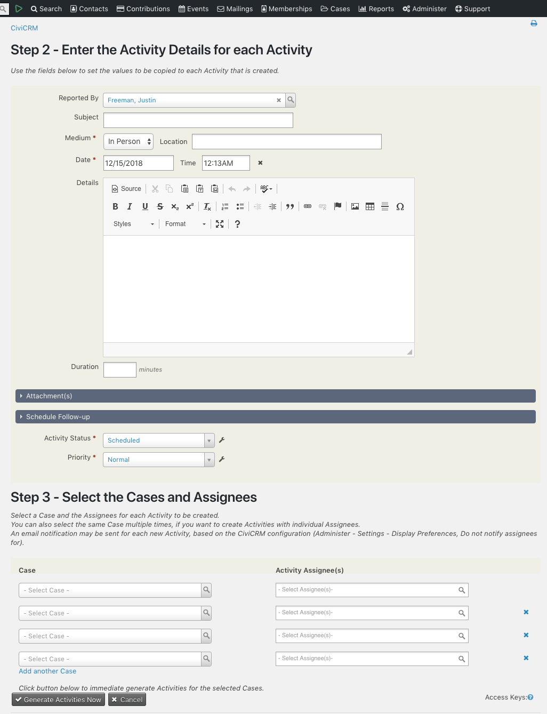

Case Activity Duplicator
------

CiviCRM extension to bulk generate and assign Activities for Cases, reducing repetitive data entry when you need to create Activities for multiple Cases in CiviCRM.

The Case Activity Duplicator enables you to quickly generate Activities for Cases and set the Assignee(s) using a single Activity as a template.

Installation
------

1. Ensure that the CiviCase (Case Management) is enabled in your CiviCRM, see "Administer / System Settings / Enable Components"
1. Download the [latest version of this extension](https://github.com/agileware/au.com.agileware.caseactivityduplicator/archive/master.zip)
1. Unzip in the CiviCRM extension directory, as defined in "System Settings / Directories'.
1. Go to "Administer / System Settings / Extensions" and enable the "Case Activity Duplicator (au.com.agileware.caseactivityduplicator)" extension.

Usage
------
1. Select **Case Activity Duplicator** from the Cases menu in CiviCRM.
1. The first step requires you to select the **Activity Type** to be used, then the fields for this Activity Type will be shown along with any custom fields that have been created.
1. Complete the fields on the Activity Form as you would normally.
1. You can then select a **Case** and the **Assignees** for **each Activity** to be created.
1. You can also select the same Case multiple times, if you want to create Activities with individual Assignees.
1. An email notification may be sent for each Activity created, based on the CiviCRM configuration, see "Administer / Customize Data and Screens / Display Preferences, Do not notify assignees for".
1. Click the **Generate Activities Now** button to immediate generate Activities for the selected Cases.

 

 

  

About the Authors
------

This CiviCRM extension was developed by the team at [Agileware](https://agileware.com.au).

[Agileware](https://agileware.com.au) provide a range of CiviCRM services including:

  * CiviCRM migration
  * CiviCRM integration
  * CiviCRM extension development
  * CiviCRM support
  * CiviCRM hosting
  * CiviCRM remote training services

Support your Australian [CiviCRM](https://civicrm.org) developers, [contact Agileware](https://agileware.com.au/contact) today!

  
